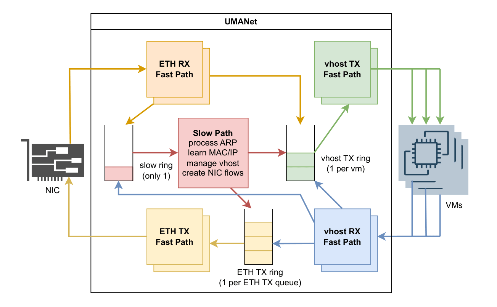
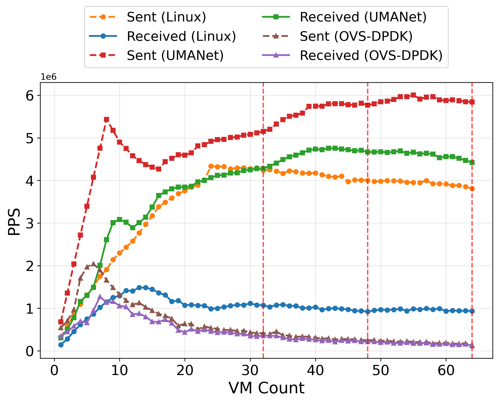

# umanet
## What is UMANet?
UMANet is a prototype L2/L3 switch tailored for microVMs running FaaS workloads, with focus on packet loss resilience.
1. **Decomposed Shared Dataplane Architecture**: A vhost-user userspace dataplane replaces Linux TAP with a decomposed fast path that cuts packet loss under high PPS across VMs.
2. **Resilience Under Packet-Rate Stress**: Under concurrent VM load, UMANet cuts TAP's loss (up to 75.71%) by 2.2× and raises received PPS by 4.7× on the same resource budget.
3. **Application-Level Performance Gains**: UMANet delivers about 50% higher HTTP throughput with sub-10ms p90 latency, improving stability for serverless-style workloads.

### Architecture
A typical DPDK switch architecture has 2 paths: fast path and slow path. The fast path is the dataplane that handles most of the traffic (common-case packet processing), and the slow path handles the other packets (e.g. ARP, MAC learning, etc.). Since DPDK requires dedicated CPU cores for its tight CPU polling, most of the cores are used for the fast path, leaving only 1 core for the slow path.

UMANet further decomposes the fast path into 4 types: ETH RX, ETH TX, vhost RX, vhost TX.
- ETH RX: Receives packets from the physical NIC and delivers them to the appropriate rings
- ETH TX: Forwards packets from the `ETH TX rings` to the physical NIC
- vhost RX: Receives packets from the VMs and delivers them to the appropriate rings
- vhost TX: Forwards packets from the `vhost TX rings` to the VMs



## Performance
UMANet achieves up to 4.7× higher received PPS and 2.2× lower packet loss than Linux TAP networking.




## Setup UMANet
> Note: please use Linux (some syscalls in code are Linux-only)

- `init-dpdk.sh` installs meson-1.5, dpdk-21.11.9, and shared library for IPsec-MB
```bash
# make sure to run this, even if it's TAP, ovs-dpdk (there's CPU settings + Intel NIC config)
./setup/cpu/slice_cpu.sh tap
./setup/init-dpdk.sh

# reserve hugepages
# 24576 × 2 MB = 48 GB mem for hugepages
sudo sysctl -w vm.nr_hugepages=24576
grep Huge /proc/meminfo

# mount hugepage FS
sudo mkdir -p /mnt/huge
sudo mount -t hugetlbfs nodev /mnt/huge

# check mounts
mount | grep huge

# load VFIO kernel modules
sudo modprobe vfio
sudo modprobe vfio-pci
lsmod | grep vfio
sudo dmesg | grep -e DMAR -e IOMMU

# check NICs
sudo dpdk-devbind.py --status

# unmount
sudo umount -l /dev/hugepages

# Clean up any leftover hugepage files from previous runs
sudo umount -l /mnt/huge
sudo rm -f /mnt/huge/*
sudo rm -rf /dev/shm/rte_* # remove shm
sudo rm -f /dev/hugepages/tas_memory
```

## Running UMANet
- copy `.env.template` to `.env` and fill in the values
- `ETH_RX_CORES`, `ETH_TX_CORES`, `VHOST_RX_CORES`, `VHOST_TX_CORES` are the number of cores to use for the fast path, configurable in `.env`
- please do vm setup first, see `setup/setup_vm.md`
```bash
# debug
tmux new -s dpdk
sudo ./build_and_run.sh debug 32 1
# terminal 2
tail -f switch.log

# test
sudo ./build_and_run.sh test 32 1

# kill process
sudo ps aux | grep vhost-switch | grep -v grep | awk '{print $2}' | xargs kill -9

# Or install and run from PATH
sudo ninja -C build install
sudo vhost-switch -l 2-3 -n 4 -b 0000:01:00.0 -- --portmask 0x1 --socket-file /mnt/huge/sock0 --stats 1
```

## Development
- `./build_and_run.sh` to check it builds and runs
- spin up a CH VM to test the TCP stack works
